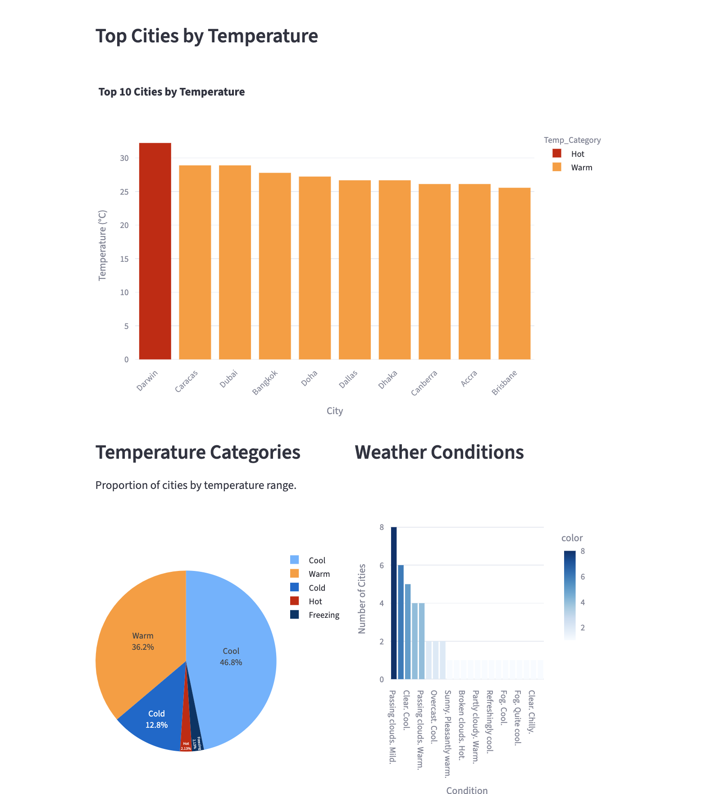
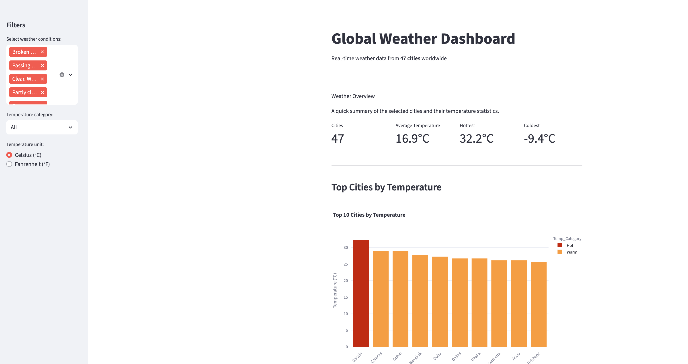
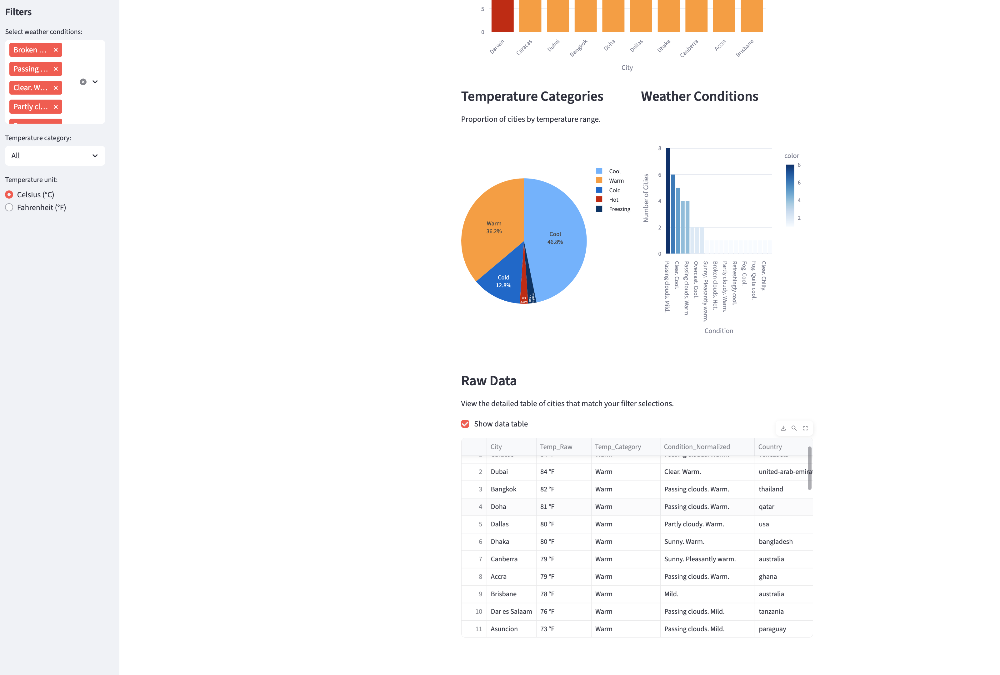

# Global Weather Dashboard
An interactive data visualization app built with **Streamlit** and **Plotly Express**.  
It displays real-time global weather conditions, allowing users to explore cities by temperature, weather category, and conditions.

This dashboard loads and visualizes worldwide weather data scraped from https://www.timeanddate.com/weather/.  
It provides insights into temperature distribution, weather conditions through interactive charts and metrics.

#Features
1 Clean, responsive layout built with Streamlit.
2 Interactive filters for weather condition and temperature category.
3 Dynamic temperature conversion (Celsius / Fahrenheit).
4 Multiple visualizations:
    a) Bar chart of top cities by temperature
    b) Pie chart of temperature categories
    c) Bar chart of weather condition counts
5 Data table view of filtered results.

#Setup Instructions
git clone https://github.com/AnnaViktorovna/python_final
cd python_final

Create a virtual environment: python3 -m venv venv
source venv/bin/activate

Install dependencies: pip install -r requirements.txt

Run streamlit run Dashboard.py

#File Structure
python_final/
├──start.py
├──cleaning.py
├── weather_data_cleaned.csv    
├── Dashboard.py                   
├── requirements.txt            
└── README.md 

#Screenshots
|  |  | |  |

#Requirements
altair
matplotlib
numpy
pandas
plotly
seaborn
selenium
streamlit
webdriver-manager
dash
gunicorn